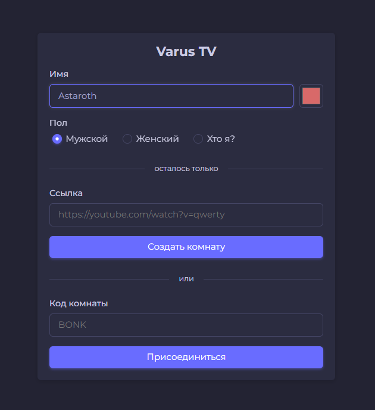
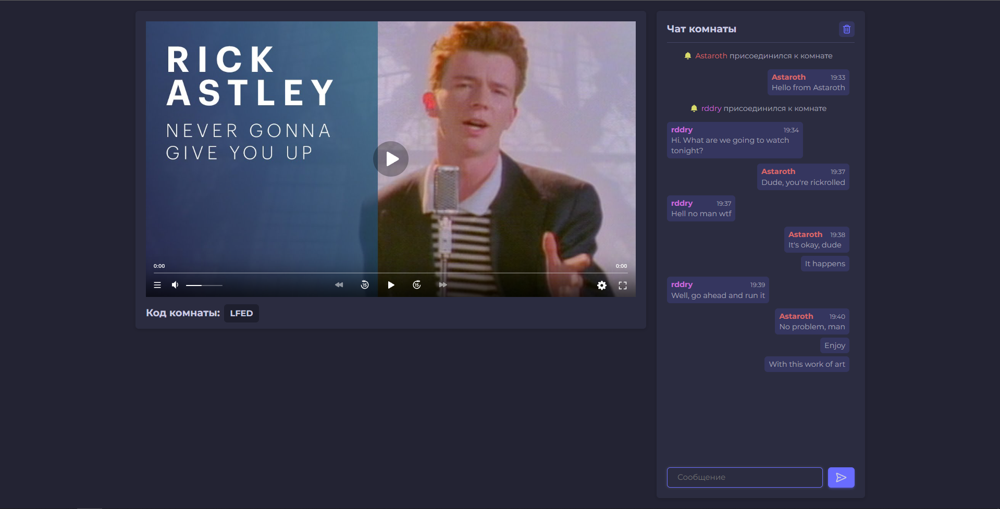
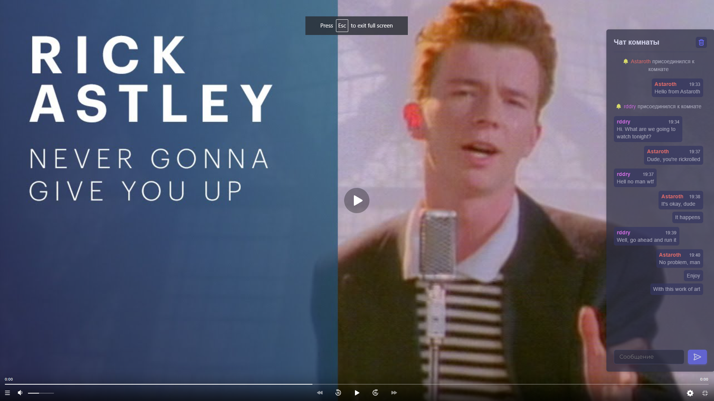

# Varus
Web application for watching YouTube and other videos together with synchronized viewing time.

## Navigation
* [Installation](#Installation)
* [Running the application](#Running-the-application)
* [UI screenshots](#UI-screenshots)

## Installation
Varus requires [Python](https://www.python.org/) to run.

Steps to configure the application:
1. Install the library for creating virtual environments:
```sh
pip install virtualenv
```
2. Go to the folder with the `server.py` file:
```sh
cd path\to\file
```
3. Create a virtual environment and activate it:
```sh
virtualenv venv
```
```sh
venv\Scripts\activate
```
4. Install the dependencies:
```sh
pip install -r requirements.txt
```
5. Remove `sample` from `config.py.sample` or create a `config.py` file with its contents.
6. Change the host and port to your own, or leave it as it is if you are testing on a local machine.

## Running the application
1. Activate the virtual environment.
2. Run the server:
```sh
python server.py
```

## UI screenshots
1. Form of room creation.



2. Form of room creation.



3. Fullscreen mod.

